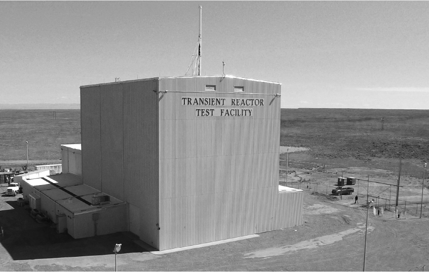

## Final Project
### MATH283 Spring '26
#### v.0.8

*"The world’s most dynamic and flexible transient test reactor is available for research and demonstration activities. The Transient Reactor Test (TREAT) Facility provides a transformational research platform that links science and engineering capabilities for the advancement of fundamental science and nuclear technology. TREAT will directly couple the response of fuel and fissile-material systems to complex environments experienced under a variety of operational and off-normal transient events anticipated in nuclear reactors. From scientific discovery to technology development and deployment, TREAT will enable the advancement of nuclear fuel science and engineering required to optimize operation of the existing light water reactor fleet, as well as advanced reactors of the future."* 
-from the Idaho National Lab website https://inl.gov/mfc/facilities/treat/

